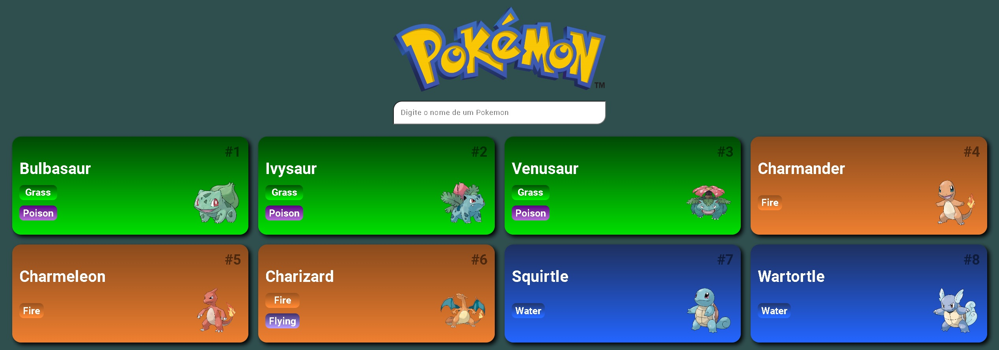
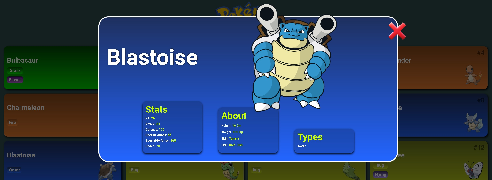

# Pokedex-DIO

Projeto feito durante o curso de Javascript na DIO. 
O projeto teve diversas alterações, como modal com uma descrição detalhada do Pokemon. 
Também foi inserido a opção de busca por um Pokemon específico. 

O projeto faz consumo da [POKEAPI](https://pokeapi.co/) 

[Clique aqui Para visualizar](https://clayton-kennedy.github.io/Pokedex-DIO/)

 

